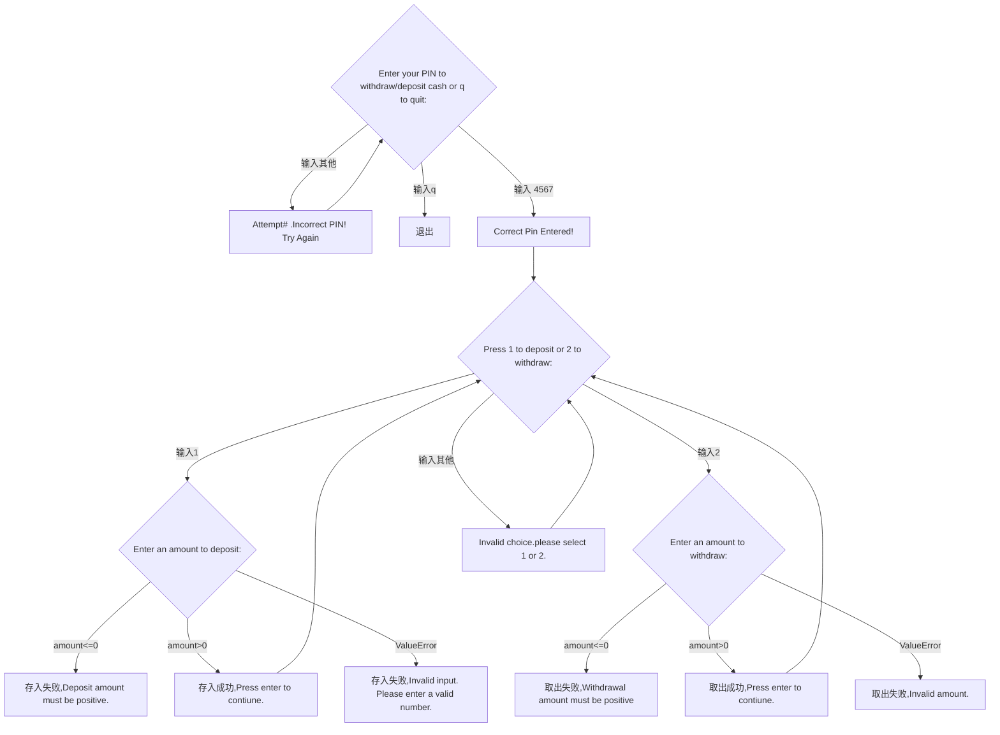

# 作业4,流程图

## 一 作业4

```mermaid
graph TD

    %%注释:输入pin码
    start{Enter your PIN to withdraw/deposit cash or q to quit:} -->|输入其他| input_error1[Attempt# .Incorrect PIN! Try Again] -->start
    start -->|输入q| exit[退出]
    start -->|输入 4567| input_pin_success[Correct Pin Entered!]

    input_pin_success -->input_action{Press 1 to deposit or 2 to withdraw:}

    %%输入操作
    input_action -->|输入1 |deposit_1{Enter an amount to deposit:}
    input_action -->|输入2| withdraw_1{Enter an amount to withdraw:}
    input_action -->|输入其他| input_action_error[Invalid choice.please select 1 or 2.]-->input_action

    %%存入流程
    deposit_1 -->|amount<=0|deposit_1_error[存入失败,Deposit amount must be positive.]
    deposit_1 -->|amount>0|deposit_1_success[存入成功,Press enter to contiune.] -->input_action
    deposit_1 -->|ValueError|deposit_1_except[存入失败,Invalid input. Please enter a valid number.]

    %%取出流程
    withdraw_1 -->|amount<=0|withdraw_1_error[取出失败,Withdrawal amount must be positive]
    withdraw_1 -->|amount>0|withdraw_1_success[取出成功,Press enter to contiune.] -->input_action
    withdraw_1 -->|ValueError|withdraw_1_except[取出失败,Invalid amount.]

```