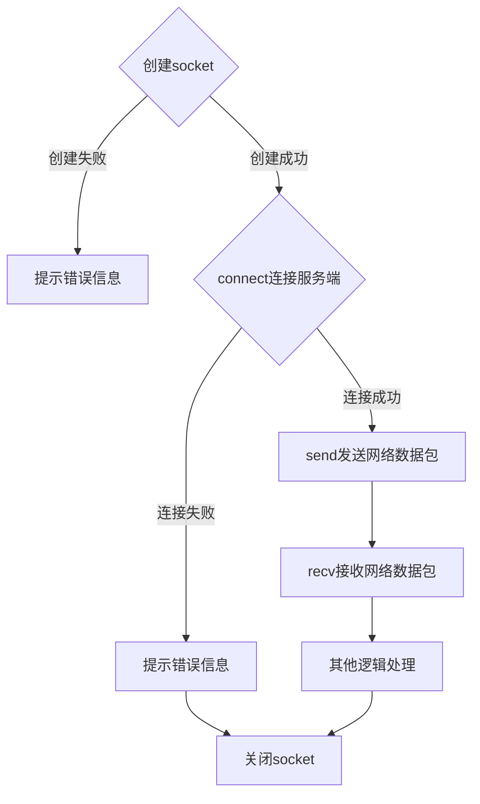

# TCP/IP socket通讯,流程图

## 一 client 流程

```mermaid
graph TD

    create{创建socket} -->|创建失败| create_socker_error[提示错误信息]
    create -->|创建成功| connect{connect连接服务端}

    connect -->|连接失败| connect_server_error[提示错误信息]
    connect -->|连接成功| send[send发送网络数据包]

    send --> recv[recv接收网络数据包]
    recv --> logic_handle[其他逻辑处理]

    connect_server_error --> close[关闭socket]
    logic_handle --> close
```