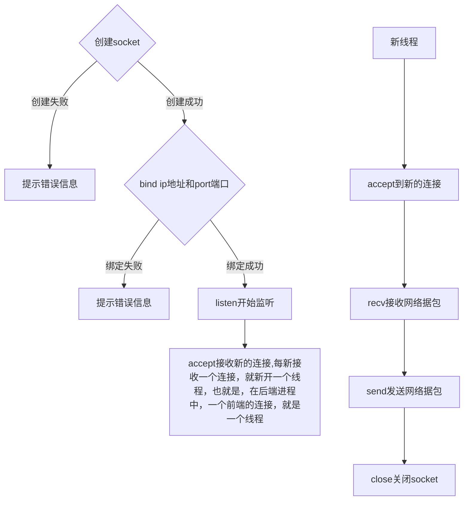

# TCP/IP socket通讯,流程图

## 一 server 流程

```mermaid
graph TD

    create{创建socket} -->|创建失败| create_socker_error[提示错误信息]
    create -->|创建成功| bind{bind ip地址和port端口}

    bind -->|绑定失败| bind_ip_error[提示错误信息]
    bind -->|绑定成功| listen[listen开始监听]

    listen --> accept[accept接收新的连接,每新接收一个连接，就新开一个线程，也就是，在后端进程中，一个前端的连接，就是一个线程]

    new_thread[新线程] --> new_socket[accept到新的连接]
    new_socket --> recv[recv接收网络据包]
    recv[recv接收网络据包] --> send[send发送网络据包]
    send --> close[close关闭socket]
```