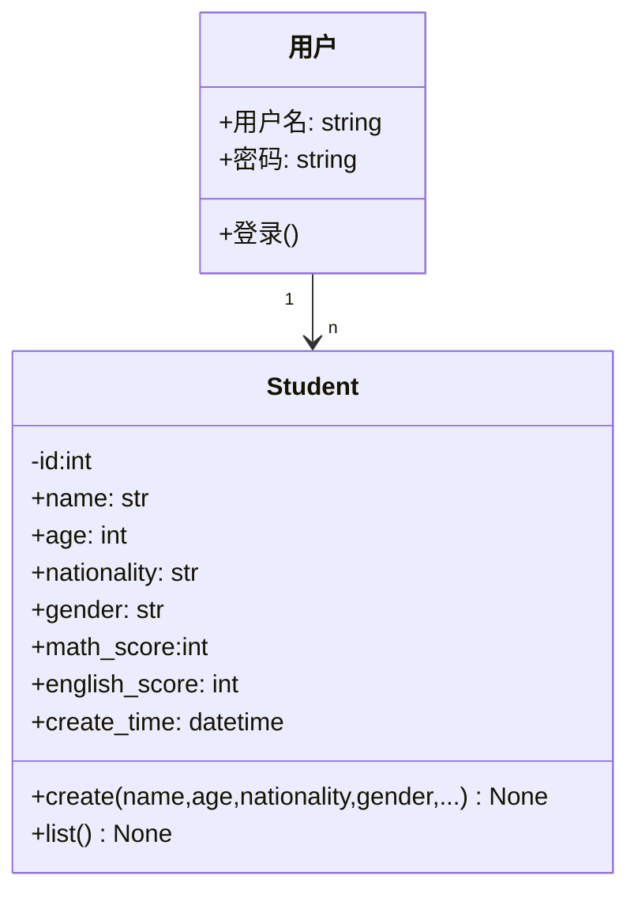

# markdown 画 类图

## 一 说明

可见性：
```
+ 表示 public
- 表示 private
# 表示 protected
~ 表示 package/internal
* 表示 Abstract
$ 表示 Static

<<Interface>> 表示 接口类
<<Abstract>> 表示 抽象类
<<Service>> 表示 服务类
<<Enumeration>> 表示 枚举
```

## 二 实列




​```mermaid
classDiagram
classA <|-- classB : 继承
classC *-- classD : 组合
classE o-- classF : 聚合
classG <-- classH : 关联
classI -- classJ : 实线
classK <.. classL : 依赖
classM <|.. classN : 实现
classO .. classP : 虚线
```